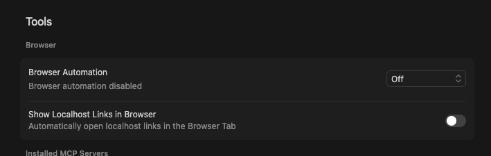

# Demo Recorder MCP

An MCP (Model Context Protocol) server that enables AI agents to create professional demo videos with synchronized voiceover narration. Works with **any website or web application**.

## Example: What You Can Create

[](https://www.youtube.com/watch?v=ns8jh_38fRA)

**[Watch the full demo on YouTube →](https://www.youtube.com/watch?v=ns8jh_38fRA)**

This 7-minute demo was created entirely by an AI agent using this tool. It showcases deploying a custom agent with MLflow integration on Kagenti, including:
- Navigating the UI and filling forms
- Deploying a custom container image
- Configuring environment variables and ports
- Testing the deployed agent via chat
- Exploring MLflow metrics and tracking

---

## Features

- **Screen Recording** - Capture browser windows at 30fps
- **Text-to-Speech** - Generate voiceover using OpenAI TTS (with API key) or Edge TTS (free)
- **Audio-Video Sync** - Adjust video speed to match narration length (preserves all content)
- **Scene-Based Workflow** - Built-in guides enforce short, manageable recordings
- **Multiple Modes** - Host (recommended for quality), Container (self-contained)

## Two Access Modes

| Mode | Best For | Browser Automation | Quality |
|------|----------|-------------------|---------|
| **Host Mode** | Production demos, native screen quality | Playwright MCP (separate) | **Best** - Native resolution |
| **Container Mode** | Quick setup, CI/CD, reproducible builds | Playwright (included) | Good - Virtual display |

---

## Quick Start: Host Mode (Recommended)

Host mode provides the **best video quality** by capturing your native screen. This is the recommended setup for creating professional demos.

### Prerequisites

- **Python 3.10+** - For demo-recorder-mcp
- **Node.js 18+** - For Playwright MCP (`npx` command)
- **FFmpeg** - For video processing (`brew install ffmpeg` on macOS)
- **Chrome** - Recommended browser for Playwright

### Step 1: Install Demo Recorder

```bash
git clone https://github.com/Schimuneck/demo-recorder-mcp.git
cd demo-recorder-mcp
python -m venv .venv && source .venv/bin/activate
pip install -e ".[all]"
```

### Step 2: Configure Cursor MCP

Add to `~/.cursor/mcp.json`:

```json
{
  "mcpServers": {
    "playwright": {
      "command": "npx",
      "args": [
        "@playwright/mcp@latest",
        "--browser=chrome",
        "--isolated"
      ]
    },
    "demo-recorder-local": {
      "command": "/path/to/demo-recorder-mcp/.venv/bin/recorder",
      "env": {
        "OPENAI_API_KEY": "sk-your-openai-key",
        "RECORDINGS_DIR": "${workspaceFolder}/recordings"
      }
    }
  }
}
```

> **Important:** Replace `/path/to/demo-recorder-mcp` with your actual installation path.

### Step 3: Disable Cursor Browser Automation (Critical!)

⚠️ **This step is required** to avoid viewport overflow and window detection issues.

1. Open Cursor Settings:
   - macOS: `Cmd + ,`
   - Windows/Linux: `Ctrl + ,`
2. In the left sidebar, click **"Tools"**
3. Find the **"Browser"** section
4. Set **"Browser Automation"** to **"Off"**
5. Optionally, also disable **"Show Localhost Links in Browser"**

<p align="center">
  
</p>

**Why is this necessary?** Cursor's built-in browser automation uses an embedded browser window that:
- Has viewport size issues (viewport larger than screen, causing overflow)
- Is difficult for the recorder to identify and capture correctly
- Conflicts with Playwright MCP when both are enabled
- Causes window title detection problems during recording

By disabling it and using Playwright MCP instead, you get a standalone Chrome window that:
- Has proper viewport sizing
- Is easy to identify by window title ("Google Chrome")
- Works reliably with the screen recorder
- Supports the `--isolated` flag for clean browser sessions

### Step 4: macOS Screen Recording Permission

On macOS, you must grant screen recording permission:

1. Go to **System Settings → Privacy & Security → Screen Recording**
2. Add **Cursor** to the allowed list
3. **Restart Cursor** after granting permission

### Step 5: Verify Setup

After restarting Cursor, test the setup:

1. Ask Cursor: *"List available windows"* → Should work without errors
2. Ask Cursor: *"Navigate to https://example.com"* → Chrome should open
3. Ask Cursor: *"Take a browser snapshot"* → Should show page structure

You're ready to create demos!

---

## Quick Start: Container Mode

Container mode is self-contained with all 36 tools (14 demo-recorder + 22 Playwright). Best for CI/CD or when you want a reproducible environment.

### Build the Container

```bash
git clone https://github.com/Schimuneck/demo-recorder-mcp.git
cd demo-recorder-mcp
podman build -t demo-recorder-mcp .  # or: docker build -t demo-recorder-mcp .
```

### Configure Cursor MCP

Add to `~/.cursor/mcp.json`:

**For Podman (macOS/Linux):**
```json
{
  "mcpServers": {
    "demo-recorder": {
      "command": "podman",
      "args": [
        "run", "-i", "--rm",
        "-v", "/path/to/recordings:/app/recordings",
        "-e", "OPENAI_API_KEY=sk-your-key",
        "demo-recorder-mcp",
        "/app/run-mcp.sh", "multi-stdio"
      ]
    }
  }
}
```

**For Docker:**
```json
{
  "mcpServers": {
    "demo-recorder": {
      "command": "docker",
      "args": [
        "run", "-i", "--rm",
        "--add-host=host.docker.internal:host-gateway",
        "-v", "/path/to/recordings:/app/recordings",
        "-e", "OPENAI_API_KEY=sk-your-key",
        "demo-recorder-mcp",
        "/app/run-mcp.sh", "multi-stdio"
      ]
    }
  }
}
```

> **Note:** To access local dev servers from the container, see [Accessing Host Services](#accessing-host-services-from-container).

### Container HTTP/SSE Mode (Alternative)

For OpenAI Responses API or remote access:

```bash
# Build HTTP image
podman build -f Dockerfile.http -t demo-recorder-mcp:http .

# Start container
podman run -d --name demo-recorder \
  -p 8081:8081 -p 8080:8080 \
  -v ./recordings:/app/recordings \
  -e OPENAI_API_KEY=sk-your-key \
  demo-recorder-mcp:http
```

Add to Cursor MCP settings:

```json
{
  "mcpServers": {
    "demo-recorder": {
      "url": "http://localhost:8081/mcp/",
      "transport": "streamable-http"
    }
  }
}
```

---

## Host Mode Exclusive: `maximize_window` Tool

Host mode includes the `maximize_window` tool (not available in container mode) that fills the screen for better quality recordings while keeping the window title stable:

```python
browser_navigate(url="https://example.com")
maximize_window(window_title="Google Chrome")  # RECOMMENDED - fills screen, stable title
start_recording(window_title="Google Chrome")
# ... demo actions ...
```

## Architecture

```
┌─────────────────────────────────────────────────────────────────┐
│                        Container Mode                            │
│  ┌───────────────┐  ┌───────────────┐  ┌─────────────────────┐  │
│  │    Xvfb       │  │   Playwright  │  │   Demo Recorder     │  │
│  │  DISPLAY=:99  │◄─│    Browser    │  │   MCP (FFmpeg)      │  │
│  │  2560x1440    │  │   (Firefox)   │  │                     │  │
│  └───────────────┘  └───────────────┘  └─────────────────────┘  │
│         │                                        │               │
│         └──────────► x11grab capture ◄───────────┘               │
└─────────────────────────────────────────────────────────────────┘

┌─────────────────────────────────────────────────────────────────┐
│                          Host Mode                               │
│  ┌───────────────────────┐      ┌─────────────────────────────┐ │
│  │    Playwright MCP     │      │      Demo Recorder          │ │
│  │  (separate server)    │◄────▶│      MCP (FFmpeg)           │ │
│  │  browser automation   │      │   AVFoundation/gdigrab      │ │
│  └───────────────────────┘      └─────────────────────────────┘ │
│            │                             │                       │
│            ▼                             │                       │
│  ┌───────────────────────┐               │                       │
│  │  Chrome/Firefox/etc   │               │                       │
│  │   (real browser)      │◄──────────────┘                       │
│  └───────────────────────┘   native screen capture               │
└─────────────────────────────────────────────────────────────────┘
```

## Available Tools

### Recording Tools
| Tool | Description |
|------|-------------|
| `start_recording` | Start video recording (requires `window_title` parameter) |
| `stop_recording` | Stop recording and save the video file |
| `recording_status` | Check if recording is in progress |

### Audio Tools
| Tool | Description |
|------|-------------|
| `text_to_speech` | Generate voiceover (OpenAI TTS with API key, else Edge TTS) |

### Video Editing Tools
| Tool | Description |
|------|-------------|
| `adjust_video_to_audio` | Sync video duration to audio by adjusting playback speed |
| `concatenate_videos` | Join multiple scene videos into final demo |
| `media_info` | Get duration, resolution, codec info for media files |
| `list_media_files` | List all recordings with URLs (container mode) |

### Protocol Guides
| Tool | Description |
|------|-------------|
| `planning_phase_1` | Demo planning guide - call FIRST |
| `setup_phase_2` | Browser setup guide |
| `recording_phase_3` | Recording actions guide |
| `editing_phase_4` | Post-recording assembly guide |

### Utility Tools
| Tool | Description |
|------|-------------|
| `list_windows` | List visible windows |
| `window_tools` | Check window management tool availability |
| `maximize_window` | Maximize browser window to fill screen (requires `window_title`, **host mode only**) |

**Container mode** also includes all 22 **Playwright browser tools** (`browser_navigate`, `browser_click`, `browser_snapshot`, etc.) through the proxy multiplexer.

**Host mode** works best with Playwright MCP installed separately (see [Host Mode setup](#quick-start-host-mode-recommended)).

> **Playwright MCP Flags:** Always use `--browser=chrome --isolated` for best compatibility with the recorder.

## Project Structure

```
demo-recorder-mcp/
├── src/recorder/
│   ├── server.py           # Entry point (~40 lines)
│   ├── core/               # Shared types and config
│   │   ├── types.py        # WindowBounds, RecordingState, etc.
│   │   └── config.py       # Environment detection, paths
│   ├── backends/           # Recording implementations
│   │   ├── base.py         # Abstract RecordingBackend interface
│   │   ├── container.py    # x11grab + Xvfb
│   │   └── host.py         # AVFoundation (macOS), gdigrab (Win)
│   ├── tools/              # MCP tool definitions
│   │   ├── recording.py    # start/stop_recording
│   │   ├── tts.py          # text_to_speech
│   │   ├── video.py        # concatenate, adjust, media_info
│   │   ├── guides.py       # Protocol phase guides
│   │   └── windows.py      # list_windows, window_tools
│   ├── transports/         # HTTP/SSE server and multiplexer
│   │   ├── http.py
│   │   └── multiplexer.py
│   └── utils/              # Shared utilities
│       ├── ffmpeg.py       # FFmpeg helpers
│       ├── window_manager.py  # Cross-platform window detection
│       └── protocol.py     # Recording workflow guides
├── scripts/                # Container startup scripts
├── tests/                  # Test suite
├── Dockerfile              # STDIO container
├── Dockerfile.http         # HTTP/SSE container
└── pyproject.toml
```

## Scene-Based Workflow

Demos are recorded as **short scenes (10-30 seconds each)**, not one long video.

### Per-Scene Process

```
SCENE N:
1. browser_snapshot()            # Verify starting position
2. start_recording(window_title="Google Chrome")  # START recording
3. browser_wait_for(time=2)      # Viewer sees initial state
4. [scroll, click, or type]      # ACTION captured on video!
5. browser_wait_for(time=2)      # Viewer sees result
6. stop_recording()              # STOP recording
7. text_to_speech("...")         # Generate audio
8. adjust_video_to_audio(...)    # Sync video to audio
9. [Repeat for next scene]
```

### Critical: Actions DURING Recording

**WRONG** (static video):
```python
browser_scroll(400)           # NOT recorded
start_recording(window_title="Google Chrome")
browser_wait_for(time=5)      # Static page
stop_recording()
```

**CORRECT** (dynamic video):
```python
start_recording(window_title="Google Chrome")
browser_wait_for(time=2)
browser_scroll(400)           # CAPTURED!
browser_wait_for(time=2)
stop_recording()
```

## Complete Example

### Container Mode

```python
# === SETUP ===
browser_navigate(url="https://example.com")
browser_resize(width=1920, height=1080)

# === SCENE 1: Homepage ===
browser_snapshot()
start_recording(filename="scene1_raw.mp4")
browser_wait_for(time=2)
browser_scroll(direction="down", amount=400)
browser_wait_for(time=2)
stop_recording()

text_to_speech(
    text="Welcome. As we scroll down, see the key features.",
    filename="scene1_audio.mp3"
)

adjust_video_to_audio(
    video_filename="scene1_raw.mp4",
    audio_filename="scene1_audio.mp3",
    output_filename="scene1_final.mp4"
)

# === FINAL ===
concatenate_videos(
    filenames=["scene1_final.mp4", "scene2_final.mp4"],
    output_filename="demo_final.mp4"
)

media_info(filename="demo_final.mp4")
```

### Host Mode (with Playwright MCP)

```python
# === SETUP ===
browser_navigate(url="https://example.com")
maximize_window(window_title="Google Chrome")  # Fills screen, keeps title stable
# No need to wait - maximize doesn't have animation like fullscreen

# === SCENE 1: Homepage ===
browser_snapshot()
start_recording(filename="scene1_raw.mp4")
browser_wait_for(time=2)
browser_evaluate(function='() => { window.scrollBy({ top: 400, behavior: "smooth" }); }')
browser_wait_for(time=2)
stop_recording()

text_to_speech(
    text="Welcome. As we scroll down, see the key features.",
    filename="scene1_audio.mp3"
)

adjust_video_to_audio(
    video_filename="scene1_raw.mp4",
    audio_filename="scene1_audio.mp3",
    output_filename="scene1_final.mp4"
)

# === FINAL ===
concatenate_videos(
    filenames=["scene1_final.mp4", "scene2_final.mp4"],
    output_filename="demo_final.mp4"
)

media_info(filename="demo_final.mp4")
```

## Configuration

### Environment Variables

| Variable | Default | Description |
|----------|---------|-------------|
| `OPENAI_API_KEY` | (none) | OpenAI API key for TTS |
| `RECORDINGS_DIR` | `~/recordings` (host), `/app/recordings` (container) | Output directory |
| `VIDEO_SERVER_PORT` | `8080` | Video HTTP server port (container) |
| `VIDEO_SERVER_HOST` | `localhost` | Video server hostname |

## Text-to-Speech

The `text_to_speech` tool automatically selects the best available engine:

| Engine | When Used | Voice |
|--------|-----------|-------|
| OpenAI TTS | When `OPENAI_API_KEY` set | "onyx" (professional) |
| Edge TTS | Fallback (free) | "en-US-GuyNeural" |

## Accessing Host Services from Container

When running in container mode, you may want to record demos for local development servers (e.g., `localhost:3000`). By default, `localhost` inside a container refers to the container itself, not your host machine.

### Podman (macOS/Linux)

Podman automatically provides `host.containers.internal` which resolves to your host machine:

```python
# Navigate to your local dev server
browser_navigate(url="http://host.containers.internal:3000")
```

**No extra flags needed** - this works out of the box with Podman.

**Important:** Your dev server must allow connections from this hostname. For Vite, add to `vite.config.ts`:

```typescript
export default defineConfig({
  server: {
    host: true,
    allowedHosts: ['host.containers.internal'],
  },
})
```

### Docker

Docker requires the `--add-host` flag to enable host access:

```json
"args": [
    "run", "-i", "--rm",
    "--add-host=host.docker.internal:host-gateway",
    "-v", "/path/to/recordings:/app/recordings",
    "-e", "OPENAI_API_KEY=sk-your-key",
    "demo-recorder-mcp",
    "/app/run-mcp.sh", "multi-stdio"
]
```

Then navigate using:

```python
browser_navigate(url="http://host.docker.internal:3000")
```

**Important:** Your dev server must allow connections from this hostname. For Vite, add to `vite.config.ts`:

```typescript
export default defineConfig({
  server: {
    host: true,
    allowedHosts: ['host.docker.internal'],
  },
})
```

### Summary Table

| Runtime | Hostname | Extra Flags Needed |
|---------|----------|-------------------|
| Podman | `host.containers.internal` | None |
| Docker | `host.docker.internal` | `--add-host=host.docker.internal:host-gateway` |

## Troubleshooting

### Host Mode: Viewport Larger Than Screen

**Symptom:** Browser viewport extends beyond screen boundaries, making recording impossible.

**Cause:** Cursor's built-in Browser Automation conflicts with Playwright MCP.

**Solution:**
1. Disable Cursor Browser Automation (Settings → Tools & MCP → Browser Automation → OFF)
2. Use Playwright MCP with `--browser=chrome --isolated` flags
3. Restart Cursor

### Host Mode: Window Not Found During Recording

**Symptom:** `start_recording` fails with "Window not found" error.

**Cause:** Window title changed (e.g., navigating between pages), or Cursor's embedded browser is being detected instead of Chrome.

**Solutions:**
1. Use the exact window title shown by `list_windows()`
2. Ensure Cursor Browser Automation is disabled
3. Check that Chrome (not Cursor) is the active browser window
4. Use `maximize_window(window_title="Google Chrome")` before recording

### Host Mode: Multiple Monitors / Retina Display Issues

**Symptom:** Recording captures wrong screen or has resolution issues.

**Solutions:**
1. Move Chrome to your primary display before recording
2. Use `maximize_window()` to ensure consistent window bounds
3. For Retina displays, the recorder automatically handles scaling

### Host Mode: Screen Recording Permission (macOS)

**Symptom:** Recording fails silently or produces black video.

**Solution:**
1. **System Settings → Privacy & Security → Screen Recording**
2. Add **Cursor** to allowed list
3. **Restart Cursor** (required for permission to take effect)

### Container: No Windows Found

`list_windows()` requires a browser window to exist:
```python
browser_navigate(url="https://example.com")  # First!
list_windows()  # Now returns Firefox window
```

### Video Out of Sync

Break demos into shorter scenes (10-30 seconds). Long recordings need extreme speed adjustments.

### Container HTTP: Health Check

```bash
curl http://localhost:8081/health
# {"status":"healthy","service":"demo-recorder-mcp","tools_count":36}
```

### Orphaned FFmpeg Processes

**Symptom:** New recordings fail or produce 0-byte files.

**Cause:** Previous recording wasn't properly stopped, leaving FFmpeg running.

**Solution:**
```bash
# Check for orphaned processes
ps aux | grep ffmpeg

# Kill if found
pkill -9 ffmpeg
```

The recorder now automatically cleans up orphaned processes on startup.

---

## Common Mistakes to Avoid

| ❌ Don't | ✅ Do Instead |
|----------|---------------|
| Use Cursor Browser Automation with Playwright MCP | Disable Cursor Browser Automation |
| Use `@anthropic-ai/mcp-server-playwright` | Use `@playwright/mcp@latest --browser=chrome --isolated` |
| Omit `--isolated` flag | Always include `--isolated` to avoid browser conflicts |
| Record long 5+ minute scenes | Break into 10-30 second scenes, then concatenate |
| Skip `maximize_window()` | Always maximize for consistent window bounds |
| Use Cursor's embedded browser | Use standalone Chrome via Playwright MCP |

## Development

```bash
# Setup
git clone https://github.com/Schimuneck/demo-recorder-mcp.git
cd demo-recorder-mcp
python -m venv .venv && source .venv/bin/activate
pip install -e ".[dev]"

# Run tests
pytest tests/ -v

# Build container
podman build -t demo-recorder-mcp .
podman build -f Dockerfile.http -t demo-recorder-mcp:http .
```

## Contributing

Contributions welcome! See [CONTRIBUTING.md](CONTRIBUTING.md).

## License

MIT License - see [LICENSE](LICENSE).
